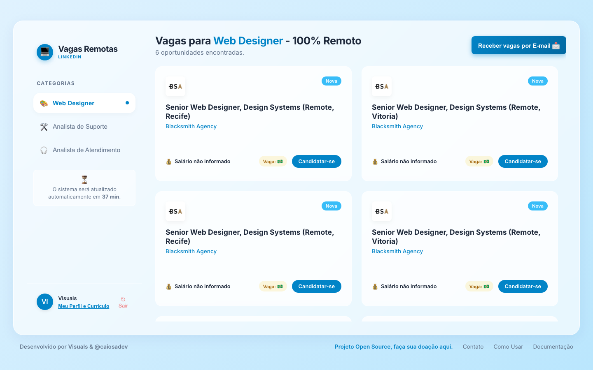

# Oportunidades - Sistema de Gestão e Scraping de Vagas



Um ecossistema completo para extração automatizada, gestão e notificação de vagas de emprego voltadas para o mercado de tecnologia. A aplicação busca ativamente oportunidades, aplica filtros de concorrência e apresenta uma interface moderna para que candidatos acompanhem o mercado.

🌍 **Acesse a Aplicação Online:** [https://appvagaslinkedin-six.vercel.app/](https://appvagaslinkedin-six.vercel.app/)

---

## 🎯 O que o usuário pode fazer na plataforma?

A plataforma foi desenhada para ser o assistente definitivo na busca por vagas. Quando o usuário acessa o sistema, ele tem à sua disposição as seguintes funcionalidades:

1. **Painel de Vagas (Job Grid):** Visualizar vagas atualizadas em uma interface incrivelmente moderna (estilo Glassmorphism). As vagas trazem um resumo descritivo, quantidade de candidaturas concorrentes e a empresa contratante.
2. **Scraper Automático de Feed e Páginas:** O motor extrai vagas nos feeds, na pesquisa de empregos e em **Company Pages** chaves (ex: *Home Office - Vagas Remotas*, *Nerdin*, etc), sendo atualizado a cada hora.
3. **Sistema de Contas:** O usuário pode se cadastrar e fazer login de forma totalmente segura para salvar o seu progresso na nuvem.
4. **Análise de Currículo Inteligente:** O usuário pode fazer o upload do seu currículo em PDF (ou imagem). O sistema fará a leitura e calculará via TF-IDF um **Score de Afinidade (%)** para cada vaga.
5. **Integração Visual com LinkedIn:** O usuário pode fornecer a URL do seu perfil para vincular à conta, gerenciar e desconectar quando quiser.
6. **Assinatura de Newsletter Segmentada e Resiliente:** 
   - O usuário escolhe as áreas do seu interesse (Web Design, Suporte, etc) e define a periodicidade (1x, 3x ou 5x ao dia).
   - **Sistema de Caching/Fallback:** Caso não hajam vagas novíssimas naquela hora, o script consome os caches inteligentes locais para garantir que a oportunidade perfeita chegue na hora certa.
   - Preparado para integração imediata com ferramentas SMTP de ponta (SendPulse, Brevo, Resend) garantindo bypass de filtros Anti-Spam.
7. **Formulário de Contato e Suporte:** Canal direto com a administração do sistema, equipado com filtros anti-spam.
8. **Painel de Administração Protegido:** Rota de acesso exclusivo para gerenciamento e auditoria (`/admin/subscribers`).
   - Acesso seguro via autenticação básica.
   - Exibição do status dos inscritos (Ativos ou Inativos/Descadastrados) usando técnica de *Soft Delete* sem expor dados sigilosos à web.
   - Exportação integral para CSV (Excel) com 1 clique para gestão analítica.

### 📖 Tutorial Passo a Passo
Preparamos um guia visual e detalhado para ajudar novos usuários a explorarem todas essas ferramentas. 
[👉 Clique aqui para acessar o nosso Tutorial de Uso](https://appvagaslinkedin-six.vercel.app/tutorial.html)

---

## ⚙️ Como toda a aplicação funciona passo a passo?

A aplicação atua dividida em três pilares principais que operam sozinhos 24 horas por dia:

### 1. Motor de Busca (Web Scraper)
* O backend (em Python) possui uma rotina de *background jobs* operada pelo `apscheduler`. A cada 1 hora, de forma invisível, um robô acessa o LinkedIn e varre milhares de dados utilizando as credenciais de sistema.
* **Dupla Fonte de Extração:** Ele busca oportunidades oficiais listadas na **seção de Vagas do LinkedIn** e, simultaneamente, varre a **Timeline (Feed do LinkedIn)** atrás de posts de recrutadores divulgando oportunidades diretamente em publicações (ex: *"Estamos contratando"*, *"Vaga 100% remota"*). Essa dupla checagem garante que nenhuma oportunidade escondida passe despercebida.
* Após a extração, o script analisa a "concorrência" daquela vaga (número de likes, comentários, candidaturas no LinkedIn) e salva apenas as melhores no banco de dados temporário.

### 2. A Inteligência de Análise (Matching Engine)
* Quando o usuário sobe um currículo, o sistema não lê apenas texto. Se for uma imagem disfarçada de PDF, a engine de **OCR (Tesseract)** é acionada para extrair os caracteres contidos nas imagens.
* Todo o texto lido passa por um algoritmo matemático de *Machine Learning* chamado **TF-IDF (Term Frequency - Inverse Document Frequency)** cruzado com similaridade de cossenos. Isso significa que o sistema compara tecnicamente as palavras-chave exigidas na vaga com as palavras presentes na experiência do currículo, gerando o "Score" em porcentagem que o usuário visualiza na tela.

### 3. O Distribuidor (Newsletter e Notificações)
* O usuário que se cadastrou na Newsletter vai para um banco de dados inteligente isolado (`newsletter.db`).
* Nos horários estipulados (manhã, tarde, noite), o servidor lê todos os assinantes, agrupa as vagas mais quentes e menos concorridas baseando-se nas categorias escolhidas, e constrói dinamicamente um E-mail de notificação profissional em HTML. 
* O servidor dispara tudo via `SMTP`, com intervalos anti-spam automáticos. E cada e-mail traz o seu próprio token criptografado único, caso o usuário queira clicar no link seguro para se descadastrar com um clique.

---

## Tecnologias Utilizadas e Infraestrutura em Nuvem

### 🚀 Hospedagem e Deploy
* **Frontend:** Hospedado gratuitamente na **Vercel** (alta disponibilidade e CDN global).
* **Backend:** API e rotinas de scraping hospedadas gratuitamente no **Render** (processos contínuos).
* **Banco de Dados:** **Supabase (PostgreSQL)** hospedado na nuvem garantindo a persistência eterna e escalável dos usuários (possui fallback para SQLite caso executado localmente sem credenciais).

### Backend (Core Engine)
* **Python 3.x / Flask** (API RESTful)
* **PostgreSQL / Supabase** (Armazenamento definitivo na nuvem)
* **APScheduler** (Agendador de tarefas assíncronas)
* **PyMuPDF / pytesseract** (Motor de OCR e manipulação de arquivos)
* **scikit-learn** (Cálculo de similaridade de texto vetorial via TF-IDF)

### Frontend (UI/UX)
* **React** (Vite)
* **CSS Moderno / Glassmorphism** (Interface focada em alta usabilidade e estética Premium)

---

## Como Executar Localmente

**Pré-requisitos:**
* Python >= 3.9
* Node.js >= 18.x

### 1. Preparando o Backend
```bash
# Crie um ambiente virtual
python -m venv venv
source venv/bin/activate  # No Windows use: venv\Scripts\activate

# Instale as dependências
pip install -r requirements.txt

# Inicie o servidor
python execution/server.py
```
O servidor rodará na porta `5000`.

### 2. Preparando o Frontend
```bash
# Instale as dependências
npm install

# Inicie o ambiente de desenvolvimento
npm run dev
```
Acesse `http://localhost:5173`.

## Autorização e Licença
Este projeto é de uso educacional/demonstrativo. Desenvolvido com foco em arquitetura de dados limpa e melhores práticas de Engenharia de Software.

---

## 💙 Apoie o Projeto

Este é um projeto **100% Open Source** e gratuito! Se esta aplicação ajudou você a conseguir um emprego, facilitou sua vida ou serviu de aprendizado, considere fazer uma doação via PIX.

Sua contribuição é o maior incentivo para continuarmos dedicando tempo ao desenvolvimento de novas funcionalidades, melhorias na IA e manutenção do código.

🔗 **[Clique aqui para abrir a página de doação no App](/#apoie)** *(Ao hospedar, garanta que este link aponta para o caminho raiz da sua aplicação)*

**Ou faça a doação direta via Chave PIX:**
`1ef67cfd-6d20-41aa-960a-37af9bc06a19`

Muito obrigado pelo apoio! 🚀
